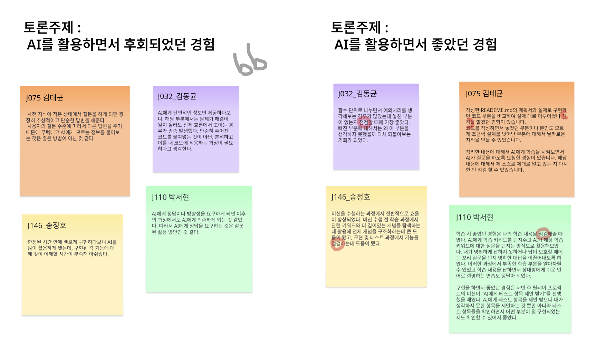
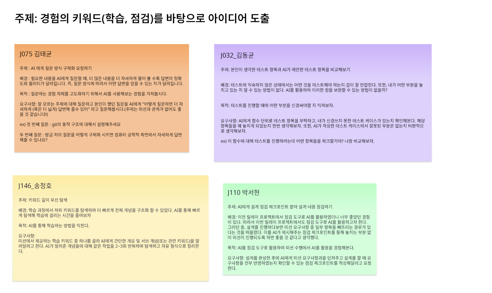

# Week 3 릴레이 프로젝트

> J032, J075, J110, J146

## 이전 주제 이어받기

이전 노트에서 우리가 집중하고자 했던 부분은 다음과 같다.

> AI가 필수 기술로 자리 잡은 시대, 우리는 어떻게 AI와 함께 성장할 수 있을까요?

> 우리는 AI를 사용하며 얻었던 긍정적인 경험들을 바탕으로, 앞으로 나아갈 방향을 구체적인 '퀘스트'로 만들어 보고자 합니다.

이러한 관점에서 우리는 AI를 어떻게 바라보고, 앞으로 어떤 방식으로 AI와 함께 성장해 나갈 것인지에 대한 함께 토론을 진행했다.

<br /><br />

## 토론 내용



그래서 우리는 먼저 기존에 AI를 활용하는 과정에서 겪었던 문제점과 좋았던 부분을 정리하기로 했다. 흥미롭게도, 긍정적인 경험은 대부분 학습 과정에서 자신이 얼마나 이해하고 있는지를 점검할 수 있었던 부분에서 비롯되었다. 이는 곧 AI가 단순한 도구를 넘어 학습을 촉진하고 자기 검증을 도와주는 역할을 할 수 있다는 가능성을 보여준다.

<br />

이러한 공통된 경험을 바탕으로, 우리는 이번 릴레이 프로젝트의 핵심 키워드를 `학습`과 `점검`으로 정했다. 단순히 AI를 활용하는 데 그치지 않고, 이를 통해 개인의 학습 효과를 극대화하고 스스로의 이해도를 점검할 수 있는 구조를 만들고자 했다.

<br /><br />

## 아이디어 도출



<br /><br />

## 퀘스트 사항

### 1. 본인이 생각한 테스트 항목과 AI가 제안한 테스트 항목을 비교해보기

- 고안자: J032\_김동균

- 배경: 테스트에 익숙하지 않은 상태에서는 어떤 것을 테스트해야 하는지 감이 잘 안잡힌다. 또한, 내가 어떤 부분을 놓치고 있는 지 알 수 있는 방법이 없다. AI를 활용하여 이러한 점을 보완할 수 있는 방법이 없을까?

- 목적: 테스트를 진행할 때에 어떤 부분을 신경써야할 지 익혀보자.

- 요구사항: AI에게 함수 단위로 테스트 항목을 부탁하고, 내가 신경쓰지 못한 테스트 케이스가 있는지 확인해본다. 해당 항목들을 왜 놓치게 되었는지 한번 생각해보자. 또한, AI가 작성한 테스트 케이스에서 잘못된 부분은 없는지 비판적으로 생각해보자.

```
ex) 이 함수에 대해 테스트를 진행하려는데 어떤 항목들을 체크할거야? 나랑 비교해보자.
```

<br />

### 2. AI 에게 질문 방식 구체화 요청하기

- 고안자: J075\_김태균

- 배경: 필요한 내용을 AI에게 질문할 때, 더 많은 내용을 더 자세하게 물어 볼 수록 답변의 정확도와 퀄리티가 달라진다. 즉, 질문 방식에 따라서 어떤 답변을 얻을 수 있는 지가 달라진다.

- 목적: 질문하는 경험 자체를 고도화하기 위해서 AI를 사용해보는 경험을 가져본다.

- 요구사항: 잘 모르는 주제에 대해 질문하고 본인이 했던 질문을 AI에게 "어떻게 질문하면 더 자세하게 (혹은 더 넓게) 답변해 줄수 있어" 라고 질문해보자.(주제는 미션과 관계가 없어도 좋을 것 같아요!)

```
ex) 첫 번째 질문 : git의 동작 구조에 대해서 설명해주세요
두 번째 질문 : 방금 저의 질문을 어떻게 구체화 시키면 컴퓨터 공학적 측면에서 자세하게 답변해줄 수 있나요?
```

<br />

### 3. AI에게 설계 점검 체크포인트 받아 설계 내용 점검하기

- 고안자: J110\_박서현

- 배경: 이전 릴레이 프로젝트에서 점검 도구로 AI를 활용하였더니 너무 좋았던 경험이 있다. 따라서 이번 릴레이 프로젝트에서도 점검 도구로 AI를 활용하고자 한다. 그러던 중, 설계를 진행하다보면 미션 요구사항 중 일부 항목을 빠뜨리는 경우가 있다는 것을 떠올렸다. 이를 AI가 제시해주는 점검 체크포인트를 통해 놓치는 부분 없이 미션이 진행되도록 하면 좋을 것 같다고 생각했다.

- 목적: AI를 점검 도구로 활용하여 미션 수행에서 AI를 활용을 경험해본다.

- 요구사항: 설계를 완성한 후에 AI에게 미션 요구사항과을 던져주고 설계를 할 때 요구사항을 전부 반영하였는지 확인할 수 있는 점검 체크포인트를 작성해달라고 요청한다.

<br />

### 4. 키워드 깊이 우선 탐색

- 고안자: J146\_송정호

- 배경: 학습 과정에서 하위 키워드를 탐색하며 더 빠르게 전체 개념을 구조화 할 수 있었다. AI를 통해 빠르게 탐색해 학습에 걸리는 시간을 줄여보자

- 목적: AI를 통해 학습하는 방법을 익힌다.

- 요구사항: 미션에서 제공하는 학습 키워드 중 하나를 골라 AI에게 간단한 개요 및 서브 개념(또는 관련 키워드)을 알려달라고 한다. AI가 알려준 개념들에 대해 같은 작업을 2~3회 반복하며 탐색하고 자유 형식으로 정리한다.

<br /><br />

---
## 수행 기록
#### 퀘스트 수행인원: J099모아림, J142송민우, J301황찬우, S016서준영

## 퀘스트 선정:
#### J099모아림:
- 수행 퀘스트: 2. AI 에게 질문 방식 구체화 요청하기
- 선정 이유: 
    - 이번 챌린지 과정을 통해, 그동안 사용해 보지 않은 방향으로 AI를 써보는 활동을 하고 있다. 
    - 그 와중에 얻게 된 건, 좋은 질문을 하는 것. 즉, 프롬프트를 “어떻게” 쓰는지가 정말 중요하다는 점이었다.
    - 질문을 구체화하는 것 또한 좋은 질문 방법이 될 것 같다는 생각이 들어 2번 미션을 선정하게 되었다. 
- 수행 계획: 
    - 항상 미션이 공개될 때, 배경지식도 함께 루카스에게 공개됩니다. 
    - 저는 이 배경지식에 나오는 키워드를 바탕으로 질문방식 구체화를 진행해 볼 예정입니다.
  
#### J142송민우:
- 수행 퀘스트: 4. 키워드 깊이 우선 탐색
- 선정 이유:
    - 학습하고 싶은 내용을 깊이 학습하기 위해 키워드를 빠르게 생성하여 구조적으로 학습의 방향성을 설정가능하다.
- 수행 계획:
    - 학습 메인 키워드를 제시하고 내가 학습하고 싶은 내용을 AI에게 전달한다.
    - 서브 키워드를 정해주면 해당 키워드에 대해서 학습한다.
    - 추가로 학습한 키워드와 개선점들을 AI에게 전달하여, 다음 학습키워드에 개선되도록 한다.

#### J301황찬우:
- 수행 퀘스트: 2. AI 에게 질문 방식 구체화 요청하기
- 선정 이유: 
    - AI 활용에 있어 가장 중요한것 중 하나는 프롬프트를 잘 구성하는것
    - 다양한 형태의 표현방식이 있지만, 텍스트로만 나의 함의, 배경, 희망하는 답변 방향 등 모든 의도를 상대에게 오해없이 100% 전달하는 일은 쉽지 않음
    - 질문 프롬프트 구성 시 AI를 활용하여 더욱 내 의도를 온전하게 전달하고, 프롬프트 구성 능력을 키워보기 위해 선정 
- 수행 계획: 
    - 평소에 AI에게 질문한 부분을 기준으로, 어떻게 물어봤으면 '더욱 정확하고 완전한 답변을 기대할 수 있었을지' AI에게 물어보기
    - 하루 한번 이상 시행하고, 의미 있는 답변을 기록하고 공유하기
  
#### S016서준영:
- 수행 퀘스트: 1. 본인이 생각한 테스트 항목과 AI가 제안한 테스트 항목을 비교해보기
- 선정 이유
    - 단위 테스트 시나리오를 작성하는 데 어려움을 느끼고 있다.
    - AI의 도움을 받아 내가 미처 고려하지 못한 케이스나 시나리오를 확인함으로써, 테스트 설계 역량을 확장하고 성장에 도움이 될 것이라 판단했다.

- 수행 계획
    - 단위 테스트를 진행할 때, 적어도 하나 이상의 함수에 대해 내가 작성한 테스트 케이스와 AI가 제안한 테스트 케이스 리스트를 비교한다.
    - 비교를 통해 내가 놓친 케이스가 무엇인지 확인하고, AI가 제안한 항목이 타당한지 검토한 후 필요 시 해당 케이스를 테스트에 추가한다.
    - 이후 테스트 작성이 완료되면, 그 과정에서 얻게 된 인사이트를 정리해 기록해 둔다.

## 수행 결과: (2025.08.08 작성 예정)
#### J099모아림:
- 수행 내용:
- 느낀점:

#### J142송민우:
- 수행 내용: 키워드 깊이 우선 탐색
- 느낀점:

#### J301황찬우:
- 수행 내용:
- 느낀점:

#### S016서준영:
- 수행 내용:
- 느낀점:

